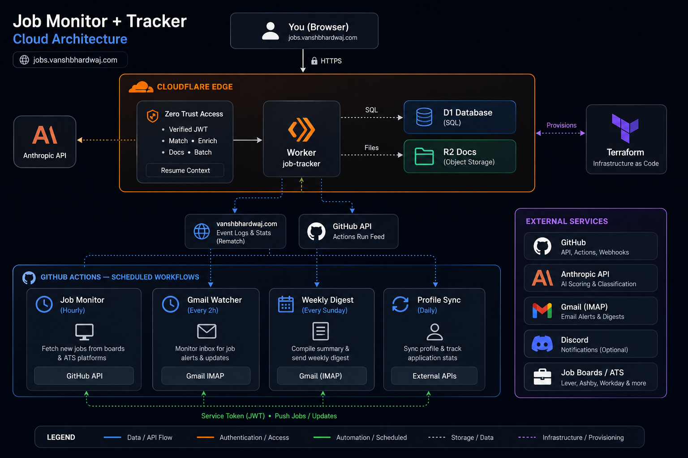
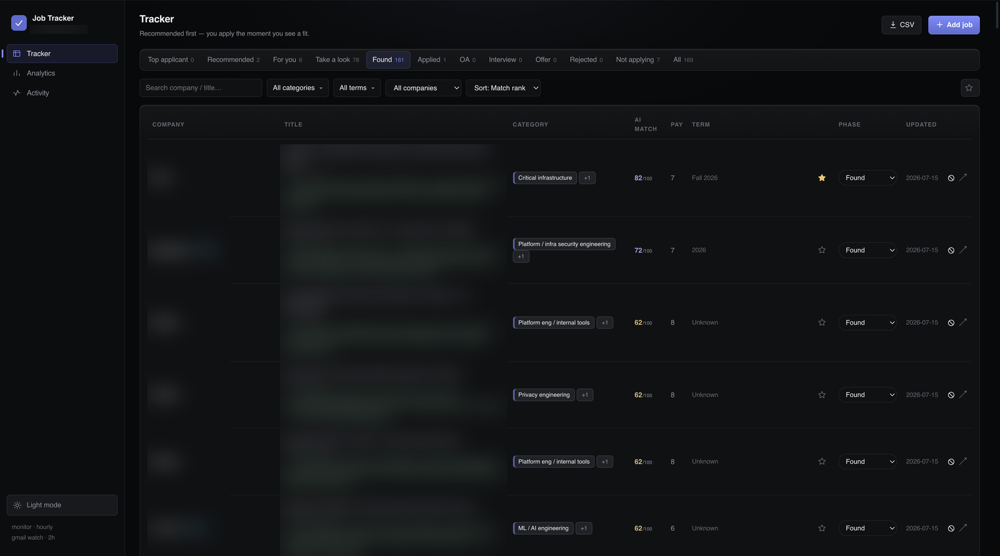
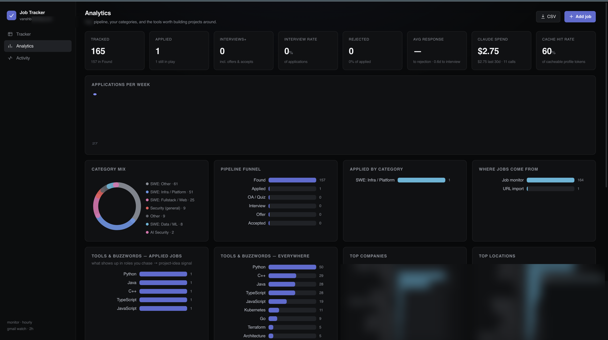
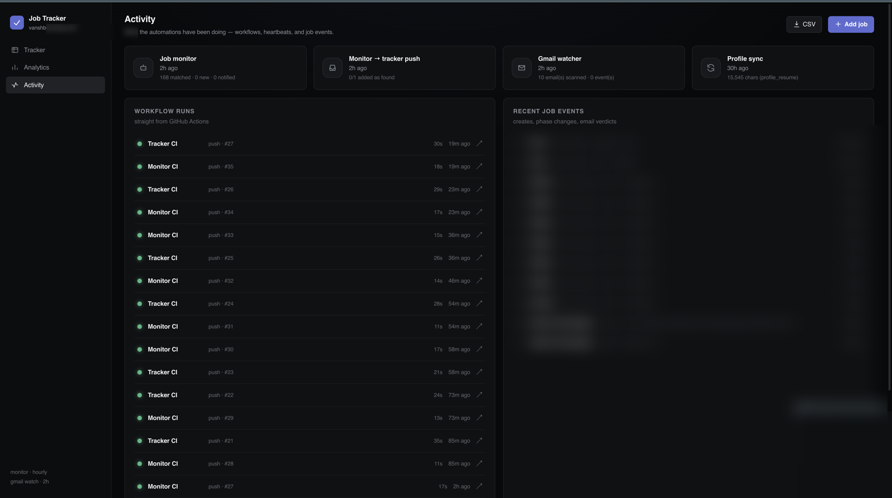

# Job Tracker Automation



> An end-to-end job-hunt automation platform: it **finds** relevant roles across the internet every hour, **scores** each one against your profile with an LLM, **tracks** everything you apply to, and **generates** tailored resumes, cover letters, and interview prep — all behind a private, single-page dashboard you can open from anywhere.

> I built this because I hated last summer's internship hunt — hundreds of tabs, copy-pasting the same resume, missing postings because I saw them a day late. I wanted one place that did the finding, the tailoring, and the tracking for me, and that I could open from my phone, my school laptop, anywhere.

> **My workflow, for integrity:** I keep a list of the specific companies and roles I genuinely want so I catch them on time — while it also surfaces strong new ones I'd have missed. Every match is triage, not a decision: I research each company myself, and I treat the generated resume/cover letter as a *baseline* I review and edit by hand. Nothing goes out that I haven't personally checked and made my own. The automation removes the busywork; the judgment and effort stay mine.

**Two deep-dives:** &nbsp; **[How I built it (design decisions) →](docs/HOW_I_BUILT_IT.md)** &nbsp;·&nbsp; **[Set it up yourself →](docs/SETUP.md)**

## Preview

The dashboard (dark, Linear-inspired, installable as a PWA). Job/company data is blurred for privacy.

**Tracker** — every found role, AI-matched and triaged into apply-now tiers:



**Analytics** — pipeline funnel, category mix, the tools/keywords showing up in roles you chase, plus live Claude token spend and prompt-cache hit rate:



**Activity** — what the automations have been doing: GitHub Actions runs, heartbeats, and a job-event feed:



---

## What this demonstrates

A production-shaped, serverless, AI-driven system — not a tutorial. Every piece has a real job:

- **Serverless full-stack** on Cloudflare Workers (edge compute), **D1** (SQLite at the edge), and **R2** (object storage) — a single-page dashboard + REST API with **zero servers to run**.
- **Zero-trust auth**: Cloudflare Access in front of the app; the Worker independently verifies the signed **JWT** (audience + issuer + RS256 signature) and enforces the owner identity as defense-in-depth.
- **Infrastructure as Code**: the entire cloud footprint (Worker, D1, R2, DNS, Access policies, service tokens) is defined in **Terraform** — reproducible, reviewable, one `apply`.
- **Event-driven automation**: scheduled **GitHub Actions** workflows scrape job boards, watch email over IMAP, and sync data through the API with least-privilege **service tokens**.
- **Applied LLM engineering**: profile-aware job matching, structured extraction, and per-job document generation using Claude — with **prompt caching**, a **daily spend guardrail**, and the **Message Batches API** to keep cost low.

## Stack

| Layer | Tech |
|---|---|
| **Edge app** | Cloudflare Workers, Hono (router), TypeScript |
| **Data** | Cloudflare D1 (SQLite), self-migrating schema |
| **Object storage** | Cloudflare R2 (uploaded resumes / cover letters) |
| **Auth** | Cloudflare Zero Trust Access (email policy + service tokens), Worker-side JWT verification |
| **IaC** | Terraform (Cloudflare provider) |
| **Automation** | GitHub Actions (cron), Python 3.12 |
| **AI** | Any provider — Anthropic / OpenAI / Gemini / local (Ollama); Message Batches + prompt caching |
| **Notifications** | Discord webhooks, Gmail (IMAP + SMTP) |
| **Frontend** | Single-page dark UI (no framework), PWA (installable) |

## How it works

```
                 hourly                        every 2h
  Job boards / ATS ─► Monitor ─► filter ─► AI score ─► Discord alert
  (Greenhouse,        (GitHub     (intern?   (Haiku)        + push to
   Lever, Ashby,       Actions)    US? cycle?)               the tracker
   Workday, Simplify…)                                          │
                                                                ▼
  You (phone / laptop) ──► Cloudflare Access ──► Worker ──► D1 (jobs, events, usage)
                            (verified JWT)         │         R2 (documents)
                                                   ├─► match each job vs YOUR profile (Haiku)
                                                   └─► generate resume / cover letter /
                                                       interview prep / answers (Opus)
  Gmail (IMAP) ──► Gmail watcher ──► classifies application emails ──► timeline + auto phase flip
```

## How it targets what you want

You define who you are and what you're after in one profile file: a **ranked list of the
companies and role types you're targeting** (each weighted by how much you want it), the
keywords that describe your field, and a short summary of your background. From that:

- **It watches your list directly** — every company you name is probed for its applicant-tracking
  system and scraped at the source.
- **It also casts a much wider net** — a crowd-sourced feed plus ATS discovery surface *extra*
  roles from companies you never listed, so you don't miss something good just because it wasn't on
  your radar.
- **Then it weighs everything against you** — every posting is scored 0–10 against your profile and
  ranked, so the best-fit roles float to the top and the noise sinks. Your weighted preferences
  anchor the scoring; the AI does the judgment on each individual posting.

The result: you tell it your targets once, and it keeps finding both those *and* the ones you'd
have wished you'd seen — already sorted by how well they fit you.

## Use any AI, host it anywhere

**Any AI provider.** Scoring and document generation route through one client
(`monitor/ai_client.py`) — set `AI_PROVIDER` to **Anthropic**, **OpenAI**,
**Google Gemini**, or a **local model** (Ollama / any OpenAI-compatible server, for
free & private). Override the model with `AI_MODEL`.

**Any host.** Pick your budget and comfort level:

- **Just the finder — free:** run the Python monitor on your laptop, in **Docker**,
  on your **own server** (cron/systemd), or on **GitHub Actions** cron.
- **The full hosted dashboard:** Cloudflare Workers + D1 + R2 + Access via Terraform
  is the one-command reference — but the tracker is a portable Hono app, and the docs
  map every piece to **AWS / GCP / Azure / self-hosted** (compute, database, object
  storage, auth). Try the whole thing locally first with `wrangler dev` (no cloud
  account needed).

Full matrix and step-by-step: **[Set it up yourself](docs/SETUP.md)**.

## Make it yours (with any AI assistant)

This repo is built to be configured by whatever AI coding assistant you use —
**Claude Code** ([`CLAUDE.md`](CLAUDE.md)), **Gemini CLI** ([`GEMINI.md`](GEMINI.md)),
**OpenAI Codex / Cursor / others** ([`AGENTS.md`](AGENTS.md)). Open the folder and
say *"set this up for me"*; it interviews you (roles, companies, schedule,
notifications, where to host, your identity for resumes) and fills in every config
file — see [`docs/CONFIGURE_WITH_AI.md`](docs/CONFIGURE_WITH_AI.md). Or by hand:

1. `cp data/profile.example.json data/profile.json` and describe who you are + what you're targeting.
2. Add your resume as `data/resume.md`.
3. Pick a setup from [Set it up yourself](docs/SETUP.md).

## Repo layout

| Path | What |
|---|---|
| `monitor/` | Python pipeline — scrape → filter → AI-score → notify → push to tracker |
| `tracker/` | Cloudflare Worker — dashboard UI + REST API + AI document generation |
| `terraform/` | All cloud infrastructure as code |
| `scripts/` | Profile sync helper |
| `data/` | Your config + runtime state (gitignored) |
| `docs/` | Full documentation + architecture diagram |

---

## Disclaimer — use it to *assist*, not to replace your effort

This tool is here to **aid** your job hunt — surfacing roles fast and giving you a
strong first draft — **not to do the work for you**. A real, thoughtful application
always wins.

- **Always review and edit AI-written resumes and cover letters before you send them.**
  Treat every draft as a starting point, never a final submission.
- **Verify everything is accurate and authentic.** The AI works only from your real
  materials and is instructed never to invent — but you are responsible for making sure
  every claim is true and genuinely sounds like *you*.
- **Do your own research on the company and role.** Personal, specific interest is what
  gets interviews. Use the generated interview-prep as a jumping-off point, then go deeper
  yourself. (Speaking from experience — this is what actually works.)
- **AI match scores are triage, not gospel** — they help you prioritize where to spend
  your time, not decide for you.
- You are responsible for everything you submit. Provided as-is under the MIT license,
  with no warranty.

---

Built with [Claude Code](https://claude.com/claude-code). MIT licensed — fork it, make it yours.
