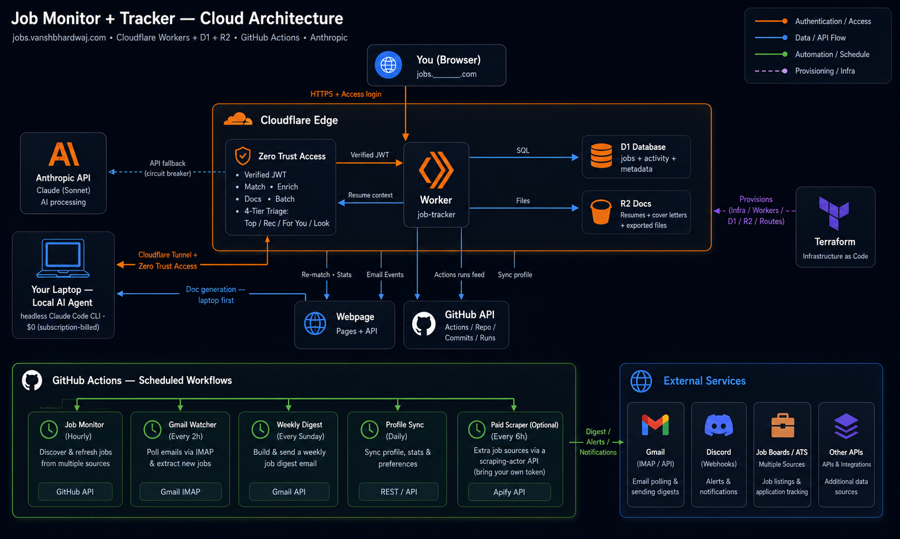

# How I Built It — Job Tracker Automation

> The deep-dive for anyone (recruiters, engineers, the curious) who wants to see
> **every decision I made and why**: architecture, the security model, cost
> engineering, and trade-offs. If you just want to run it, see
> **[Set it up yourself](SETUP.md)**.

This document explains what the system is, how it's built, and, more usefully,
*why* it's built this way. The design goal stayed constant throughout: a
personal, always-on job-hunt platform with **no servers to babysit**, **low AI
cost**, and a security posture I'd be comfortable putting my name on.

## My workflow, for integrity

I built this to **support** my search, not to outsource it. The effort and the
judgment stay mine.

- I keep a list of the **specific companies and roles I genuinely want**, so the
  system surfaces those the moment they post and I don't miss a deadline. It
  also casts a wider net, so I still catch strong roles I hadn't thought to look
  for.
- Every AI match score is a **starting point for triage, not a decision**. I
  research the company and role myself before I apply.
- The generated resume and cover letter are a **baseline**. I review and edit
  every one by hand, make sure it is accurate and sounds like me, and tailor it
  further with my own research. **Nothing goes out that I haven't personally
  checked and made my own.**

The engineering here is in the automation, the infrastructure, and the security.
It removes the busywork (finding, tracking, first drafts) so I can spend my time
on the parts that actually matter: researching, tailoring, and applying
thoughtfully.

---

## 1. Motivation

Last summer's internship hunt was death by a thousand tabs. I was refreshing job
boards, copy-pasting the same resume into a hundred portals, re-writing cover
letters from scratch, and missing good postings because I saw them a day too
late. I wanted one system that:

- **finds** relevant roles the moment they're posted, across many sources,
- **judges** each one against *my* profile so I only look at real fits,
- **tracks** everything I applied to and what happened next, and
- **writes** a tailored resume, cover letter, and interview-prep sheet per job.

I also wanted to open it from **anywhere**: my phone between classes, my school
laptop, a library machine, without running a server or exposing anything public.
That "access anywhere, run nothing" goal is why the whole thing lives on
serverless edge infrastructure behind zero-trust auth.

---

## 2. Architecture at a glance

Two halves that talk over one authenticated REST API:

- **The monitor** (Python, runs on GitHub Actions cron) is the *finder*. It
  scrapes job boards, filters, AI-scores, notifies, and pushes matches into the
  tracker.
- **The tracker** (Cloudflare Worker + D1 + R2) is the *system of record and the
  UI*. It is a single-page dashboard plus a REST API, plus the AI document
  generation.

Everything in front of the domain is gated by **Cloudflare Access** (zero trust).
Both humans (email login) and machines (GitHub Actions, via service tokens)
reach the Worker the same way. Access mints a signed JWT, and the Worker
**independently verifies it**. All of the cloud resources are defined in
**Terraform**.

---

## 3. Job discovery — stacked nets, widest to narrowest

Coverage comes from stacking sources so nothing slips through.

1. **Crowd-sourced feeds** (the community internship lists on GitHub). Thousands
   of contributors surface new postings within hours. This is the widest net,
   and it catches companies with no scrapeable API (for example Meta and Apple).
   Two repos sharing the same schema are merged and URL-deduped, so a posting
   that lands in either one first is still caught.
2. **ATS APIs** are direct, structured pulls from applicant-tracking systems
   (Greenhouse, Lever, Ashby, SmartRecruiters, Workday, Workable, Recruitee,
   BambooHR). A `classify.py` probe figures out which ATS each company uses and
   caches the answer in a registry, so the scraper never guesses.
3. **Built-in direct scrapers** handle a few big employers (Google, Amazon, and
   others) that expose bespoke career APIs.
4. **YC startup internships** (optional, `YC_DAILY=1`). Y Combinator's "Work at a
   Startup" search is login-walled, but two public surfaces compose into a feed.
   The companies directory ships a rotating public Algolia search key in an
   inline config blob, which is scraped fresh every run and never hardcoded.
   Each company's public jobs page is server-rendered with typed posting JSON in
   a `data-page` attribute. The feed queries the index for hiring companies
   matching your lanes (`YC_QUERIES`), reads each jobs page, and keeps the
   internships. That is about 60 page fetches per run, so it rides a daily cron
   rather than the hourly one, and it costs $0.
5. **Handshake job alerts** (optional). If your school uses Handshake, its
   job-alert emails become a feed. The gmail watcher recognizes the sender
   domain (end-anchored, so spoof lookalikes fail), routes those emails around
   the application-email classifier, has the AI extract the postings, unwraps the
   click-tracking links to real posting URLs, and pushes them through the same
   idempotent bulk-insert path as every scraper.

Every source is **fail-soft**. One board being down or changing shape never
takes the run down.

## 4. Filtering & categorization

Raw postings pass through `filters.py`, which is deliberately strict so the AI
only sees plausible candidates. A posting must clear all of these:

- be a real intern or co-op role (word-boundary matching, so "Internal Tools"
  doesn't slip through),
- have no seniority marker,
- not be a non-student program,
- be US-based, and
- reference the current-or-future recruiting cycle (**computed from today's
  date, so nothing is hardcoded to rot**).

Survivors get a coarse category from the profile's keyword lists before the LLM
refines it.

Two more gates run after the keyword filter.

- **An internship gate** drops postings that are *clearly* full-time or new-grad:
  a seniority title, an explicit years-of-experience bar, or a six-figure annual
  salary (interns are paid hourly). Anything ambiguous passes. Broad feeds
  occasionally mix in full-time roles, and this catches them without ever
  false-dropping a real internship, because it fails open on uncertainty.
- **An optional lane gate** (`LANE_EXCLUDE_SOC_GRC=1`, off by default because it
  encodes a preference). For candidates targeting engineering or build roles, it
  drops *unambiguously* pure SOC-analyst, GRC, compliance, or audit titles, and
  only when the title carries no build signal (engineer, developer, SRE,
  platform). It is deliberately conservative, so borderline titles pass for
  hand-triage.

De-duplication is layered. Exact job ids live in a `seen_jobs` set, so only
genuinely new postings continue. On top of that, a **URL-independent normalized
company+title key** is computed on *both* sides:

- in the monitor, so the same posting surfacing from a second feed under a
  different URL never re-alerts, and
- in the tracker, so a role found on two boards, or found by the monitor *and*
  added by hand, collapses to a single row.

**A hierarchical category taxonomy.** Categories aren't a flat list. They are a
three-level tree (top to mid to leaf, for example *Security → IAM/Identity →
IGA*). The AI tags each job with one or more **leaf** ids, because a job can
genuinely be several things at once (a security-flavored SRE role is both), and
every tag **rolls up** its ancestors. I store that rollup as a space-delimited
ancestor-closure string (`cat_path`), so a single SQL `LIKE` filters at *any*
level. Asking for "SWE" then matches every SWE leaf without enumerating them.

The same closure powers the analytics. Skill and buzzword frequencies and job
counts aggregate to whichever node you select, and the dashboard's filter is a
**tri-state tree** (tick a parent to take its whole subtree, untick one child
and the siblings stay). The taxonomy lives in one file and is served to the UI
over an endpoint, so there is a single source of truth and no drift between the
model prompt, the SQL, and the front-end.

## 5. The AI pipeline (applied LLM engineering)

Claude does the judgment work, and the deterministic filters are the cheap coarse
net. The key decisions:

- **Model routing by job.** The high-volume, low-stakes work (scoring every
  posting, extracting structured fields from a page, classifying emails) uses
  **Claude Haiku**, which is fast and cheap. The rare, high-value work
  (generating a tailored resume or cover letter) uses **Claude Opus**.

- **Enrichment before judgment.** A score is only as good as the text the model
  sees, so before matching, each job's real posting is fetched through a laddered
  pipeline:
  - the board's clean JSON API where one exists (Greenhouse, Lever, Ashby,
    Workday), then
  - the page's embedded schema.org JSON-LD, then
  - structured HTML.

  Some pages are JS-walled, and a Worker physically can't render them because
  there is no browser runtime at the edge. For those, there is an optional
  last-resort hop to a companion service I built,
  [**browser-render**](https://github.com/VanshBhardwaj1945/browser-render), an
  SSRF-hardened headless-Chromium fetcher on AWS Lambda. Pre-flight DNS checks
  and per-request interception keep an attacker-supplied URL from ever reaching
  private or cloud-metadata addresses, and its SSRF guard fails closed while its
  threat blocklist fails open. Every stage fails soft, so the worst case is
  matching degrading to title-only rather than the pipeline breaking.

- **Three-axis scoring.** Conflating "am I qualified" with "do I want it" ruins a
  tracker, because any posting containing your field's buzzword floats to the
  top. So every job gets three independent scores:
  - **match** (0–100): pure skills-vs-JD fit against the synced profile, on a
    calibrated, deliberately harsh rubric. A tracker where everything is a 90 is
    useless.
  - **like** (0–100): desirability, derived from an *optional* `preferences` note
    you sync (company tier, product and industry interests, role-type
    preferences). It defaults to a neutral 60 if you don't provide one.
  - **pay tier** (1–10).

  The apply-now tabs **dual-gate on both match and like**, with a dream-company
  exception: a very high like only needs a solid match. The rank sort blends all
  three. The model also extracts the concrete tools and keywords each posting
  names, aggregated into a "what should I learn or build" signal. Matching runs
  on a **mid-tier model (Sonnet)** for sharper judgment, and prompt caching keeps
  its cost close to the entry tier. When the rubric or schema changes, the
  workflow's manual `rematch` mode sets `REMATCH_ALL=1` and re-scores every row,
  not just the unscored ones.

- **Behaviour-driven analytics.** Beyond pipeline counts, the dashboard mines
  your own *application history* to answer the questions that actually change a
  job hunt:
  - is the fit quality of what you apply to trending up or down,
  - are you staying in your lane or drifting,
  - which lane actually converts,
  - what's going stale and needs a follow-up, and
  - is your weekly momentum holding.

  It is a tracker that reflects your behaviour back at you, not just a list.

- **Prompt caching.** The candidate profile is the big, stable part of every
  matching and document prompt, so it is sent as a cached prefix. Repeated calls
  pay about 10% for it instead of full price, and an extended (1-hour) cache
  keeps it warm across a whole session of matches and document generations.

- **Message Batches.** The weekly re-scoring pass goes through Anthropic's
  Message Batches API, which is about 50% cheaper and asynchronous. It isn't
  latency-sensitive, so there is no reason to pay real-time rates.

- **A spend guardrail.** Every Claude call logs its token usage. Document
  generation checks the day's spend against a configurable cap and refuses
  cleanly if exceeded. The dashboard surfaces spend and cache-hit rate, so cost
  is never a mystery.

- **A cost analytics center.** Claude spend is reconstructed per-day from the
  token-usage log (priced per model), and flat cloud costs (Cloudflare, Azure)
  are configured once as a monthly figure and spread across days. The dashboard
  charts a 60-day spend series you can toggle by provider or any mix, so a spike
  is obvious and attributable rather than a surprise on a bill.

- **Auto-learning skill set.** The "tools you have vs should learn" view unions
  your curated skill list with anything the market's postings mention that
  already appears verbatim in your synced profile. As the resume grows, newly
  acquired tools count as "have" without hand-editing a list.

- **Document generation.** Per job, Opus drafts a resume, cover letter,
  interview-prep sheet, or application answers, grounded strictly in your real
  materials (resume, optional GitHub repos, optional site). Resumes export to a
  pixel-matched one-page `.docx`. You can also copy the full prompt to run on
  your own Claude subscription for zero API cost, or upload the file you actually
  submitted (stored in R2 for later review).

- **In-app document handling.** Uploads use a **drag-and-drop zone**: drop
  several PDF, DOCX, or markdown files at once, and each one is sorted by
  *filename* (cover letter, resume, or `.md` briefing note) and saved instantly.
  Everything views **inline**:
  - **PDFs** render in a same-origin iframe. The security middleware carves a
    `SAMEORIGIN` exception for exactly the file-stream route, and every other
    response stays unframeable.
  - **DOCX** renders as the *actual paginated document* via a vendored,
    self-hosted docx-preview bundle served from the Worker itself (the CSP allows
    same-origin scripts only, no CDNs), zoomed to fit the modal.
  - **`.md` briefings** get a styled reading view from a small hand-rolled
    renderer (headings, fences, blockquotes, lists, rules).

  A DOCX upload also extracts its text client-side, parsing the ZIP by hand with
  the native `DecompressionStream` and zero dependencies, as a stored fallback.
  Job notes **autosave** with a debounce and a flush-on-close, so there is no
  save button.

## 6. The tracker (edge full-stack)

- **Cloudflare Worker + Hono** serve both the single-page UI and a REST API from
  one edge script. There is no origin server, and it is global by default.
- **D1** (SQLite at the edge) holds jobs, an event timeline, saved-document
  metadata, and a token-usage log. The schema **self-migrates** on cold start
  (Terraform can't run SQL), so deploys never need a manual migration step.
- **R2** stores the actual document files (the PDF or DOCX you submitted),
  streamed back through the authenticated Worker. The bucket itself is never
  public.
- **UI.** A dependency-free single-page app (dark, Linear-inspired) with phase
  tabs, AI match tiers, analytics, an activity feed, and the document tools. It
  is a **PWA**, installable to a phone home screen.

## 7. Security model

The posture is "one narrow, verified way in, and least privilege everywhere,"
described here at the level of *approach* rather than as a runbook.

- **Zero-trust edge.** Cloudflare Access fronts the entire domain. The
  workers.dev subdomain is disabled, so the Access-protected custom domain is the
  only route to the Worker.
- **Independent JWT verification.** Rather than trusting the edge blindly, the
  Worker verifies every request's Access JWT itself (signature RS256 against the
  rotating JWKS, plus audience, issuer, and expiry) and pins the algorithm to
  block "alg=none"-style forgeries. It fails closed.
- **Defense in depth.** On top of the Access policy, the Worker independently
  enforces the owner's identity, so a mis-widened policy still can't let another
  human in. Machine callers (GitHub Actions) use scoped, non-interactive
  **service tokens**.
- **One auth path.** Humans and machines authenticate the same way. There is no
  second, weaker door.
- **Input hygiene.** URLs are scheme-checked (no `javascript:` or `data:`),
  uploads are type-limited and size-limited, generated files are size-capped, and
  responses carry strict security headers (CSP, `X-Frame-Options: DENY`,
  `nosniff`, `no-referrer`). LLM prompts that ingest untrusted page or email text
  are structured to resist injection.
- **Secrets** live only in Terraform variables, GitHub Actions secrets, and
  Worker secret bindings, never in the repo. State and config files are
  gitignored.

## 8. Cost

Designed to run for pocket change. The serverless pieces (Workers, D1, R2) sit
comfortably in free tiers at personal volume. The only real cost is the
Anthropic API, which is dominated by cheap Haiku matching and kept low by prompt
caching, batching, and the daily cap. Opus is only used when you explicitly
generate a document, or when you route that to your own subscription for free.

## 9. Reliability & self-healing

Fail-open is the rule. The tracker being down never breaks the monitor, a missing
API key degrades to keyword-only results, and a broken board is skipped. The
monitor tracks per-company failure and zero-match streaks and auto-re-probes dead
ATS endpoints. A weekly digest summarizes activity and re-heals match coverage.
CI (typecheck, build, and config validation) runs on every push.

## 10. Run modes

| Mode | What runs where |
|---|---|
| **Hosted** | Worker + D1 + R2 + Access on Cloudflare (Terraform), monitor on GitHub Actions cron. Zero servers, open from anywhere. |
| **Local** | `wrangler dev` runs the full Worker against local D1 + R2 (auth bypassed). Run the monitor on your machine. |
| **Container** | `Dockerfile` runs the monitor pipeline anywhere (host cron, K8s CronJob). |

See [`CLAUDE.md`](../CLAUDE.md) to have Claude Code configure any of these for
you.

## 11. File map

| Path | Role |
|---|---|
| `monitor/scraper.py` | Orchestrates a run: scrape, filter, AI-score, notify, push |
| `monitor/sources.py` | Per-ATS and direct scrapers |
| `monitor/classify.py` | Probes which ATS a company uses, maintains the registry |
| `monitor/filters.py` | Intern, seniority, location, and cycle filtering, plus categorization |
| `monitor/ai_score.py` | Claude relevance scoring against your profile |
| `monitor/gmail_watch.py` | IMAP inbox watcher: classifies application emails and extracts Handshake job alerts |
| `monitor/digest.py` | Weekly digest, housekeeping, and match self-heal |
| `monitor/notify.py` | Discord and email delivery |
| `monitor/tracker_client.py` | Fail-open client for the tracker API |
| `tracker/src/index.ts` | Worker entry: auth, security headers, routing, PWA assets |
| `tracker/src/auth.ts` | Cloudflare Access JWT verification |
| `tracker/src/api.ts` | REST API (jobs, events, imports, documents, stats) |
| `tracker/src/db.ts` | Versioned self-migrating D1 schema |
| `tracker/src/match.ts` | Profile-aware AI matching, enrichment, prompt caching |
| `tracker/src/docgen.ts` | Per-job document generation (Opus) |
| `tracker/src/docxgen.ts` | Markdown to one-page styled `.docx` |
| `tracker/src/batch.ts` | Message Batches path for cheap re-scoring |
| `tracker/src/usage.ts` | Token-usage logging and cost accounting |
| `tracker/src/ui.html` | The single-page dashboard |
| `terraform/` | All cloud infrastructure as code |
| `scripts/sync_profile.py` | Pushes your resume and extra context (plus optional preferences) into the tracker |
| `scripts/rematch.py` | Drives rematch-all to completion from Actions (`REMATCH_ALL=1` is a full re-score) |

## 12. Design decisions & trade-offs

- **Serverless over a VM/container app** — the whole point was zero maintenance
  and access-anywhere. Workers + D1 + R2 give a global, always-on app with no
  patching, no scaling, and a generous free tier. You can still run it locally or
  in a container if you prefer (see run modes).
- **Zero-trust auth over rolling my own login** — Cloudflare Access handles
  identity, and the Worker just verifies the token. That means less code, fewer
  ways to get auth wrong, and one path that works for both the UI and automation.
- **Terraform over click-ops** — the infra is reviewable and reproducible. One
  `apply` stands the whole thing up, and there's no drift between what's deployed
  and what's written down.
- **Model routing over one big model** — Haiku for the 99% (cheap, high-volume
  judgment), Opus for the 1% that's worth it (writing). Caching, batching, and a
  spend cap keep the bill in pocket-change territory.
- **Fail-open everywhere** — a personal tool that breaks loudly is worse than one
  that degrades quietly and keeps finding jobs.
